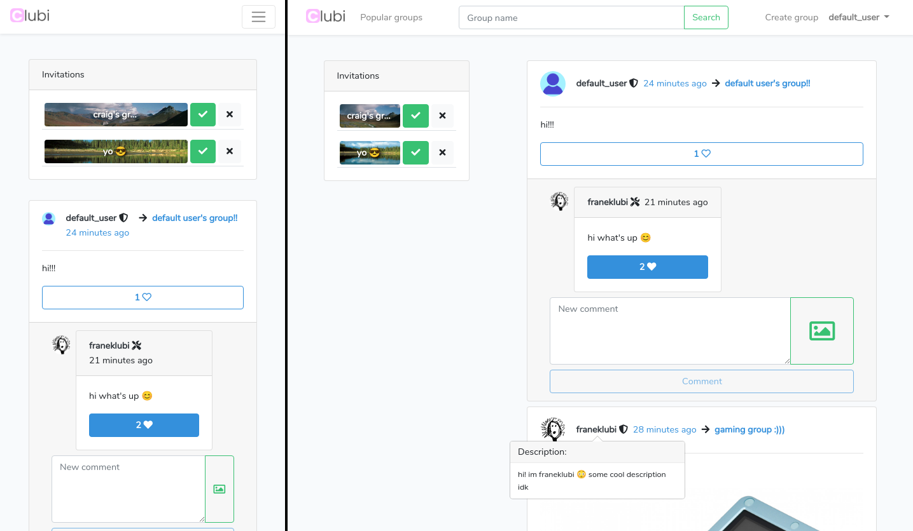

# Clubi

### Clubi is a group-oriented social media platform written in Laravel.

---
* [Features](#features)
* [Contributing](#contributing)
---

*Showcase of the responsive design*

# Features
* allows for easy (public or private) group creation and management
* distinguishes between users, group admins, and site admins
* implements user-specific feed containing latest posts from all groups the user has joined
* implements invitation system with specified controls such as: necessary admin approval for invitations to private groups
* ranks 10 most popular groups on site
* allows for searching groups by name or their id string
* users are able to attach pictures to posts/comments and also like them
* contains badges next to username indicating user's relevance:
    - post author
    - group admin
    - site admin
* implements 'Load more' functionality for posts and comments
* uses responsive design

# Contributing

Clubi welcomes contributions of any kind :)

To start contributing clone the repository and run `./dev_setup.sh` to help get You started. This script will:
* install composer and npm packages
* compile js assets
* copy the .env.example to .env
* generate secure key with artisan
* open .env in vim for You to modify it
